# Análisis de Riesgo Crediticio y Morosidad de Cartera (SQL)
Este es el proyecto de basico a avanzado en mi formacion como data analyst.

## Resumen (Overview)
_En el sector financiero, la correcta originación de créditos y la mitigación del riesgo de impago (default) son los pilares de la rentabilidad. Este proyecto simula el entorno de una entidad bancaria enfrentando altos índices de morosidad en su cartera de préstamos minoristas._

## Estructura del Proyecto

- [Sobre los Datos]
- [Análisis Exploratorio de Datos (EDA)](#análisis-exploratorio-de-datos-eda---riesgo-crediticio)
- [Fase 1: Arquitectura y Modelado de Datos](#fase-1-arquitectura-y-modelado-de-datos-etl)
- [Fase 2](#fase-2)
  - [Análisis exploratorio y salud de la Data](#fase-2-análisis-exploratorio-y-salud-de-la-data-nivel-básico)
  - [Cruces Relacionales y KPIs de Riesgo](#cruces-relacionales-y-kpis-de-riesgo-nivel-intermedio)
  - [Análisis Avanzado](#análisis-avanzado-subconsultas-ctes-y-window-functions)
- [Conclusiones](#conclusiones)

## Sobre los datos

Los datos originales, junto con una explicación de cada columna, se pueden encontrar [aquí](https://www.kaggle.com/datasets/laotse/credit-risk-dataset).

El conjunto de datos original consolida información demográfica de los solicitantes, niveles de ingresos, características estructurales de los préstamos e historial crediticio, distribuidos en más de **32,000** registros y 13 columnas. Para fines de este análisis y aplicando buenas prácticas, esta tabla plana fue normalizada en un modelo relacional de 3 tablas (Clientes, Préstamos e Historial Crediticio).

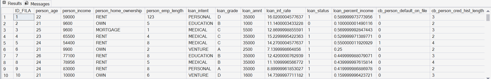
## Análisis Exploratorio de Datos (EDA) - Riesgo Crediticio

### Objetivo del Proyecto

Este proyecto individual tiene como objetivo demostrar habilidades de limpieza, modelado y análisis exploratorio de datos (EDA) utilizando **SQL Server**. A través del análisis de un dataset financiero de más de 32,000 registros de solicitudes de crédito, se busca identificar perfiles de riesgo, evaluar la salud de la cartera y extraer *insights* de negocio para la toma de decisiones.

### Herramientas y Metodología
* **Motor de Base de Datos:** SQL Server (SSMS).
* **Lenguaje:** SQL (DDL, DML, DQL).
* **Metodología:** Limpieza de Datos (Data Cleaning), Análisis Exploratorio de Datos (EDA) y Extracción sobre Modelos Relacionales Normalizados (3NF).

---
## Fase 1: Arquitectura y Modelado de Datos (ETL)

El dataset original consistía en un archivo plano desnormalizado (CSV). Para asegurar la integridad de los datos y optimizar las consultas, diseñé e implementé un modelo relacional segmentando la información en tres tablas principales:

1.  **`Clientes` (Dimensión Demográfica):** Contiene la edad, ingresos, años de empleo y situación de vivienda.
2.  **`Historial_Crediticio` (Dimensión de Riesgo Previo):** Registra si el cliente ha incurrido en morosidad histórica y la longitud de su historial.
3.  **`Prestamos` (Tabla de Hechos):** Registra el monto, la tasa de interés, el propósito del crédito y el estado actual (vigente o en default).


```sql 
ALTER TABLE DATA_CRUDA
ADD ID_FILA INT IDENTITY (1,1);
```

```sql
-- I. Normalizacion de los datos.

-- ==========================================
-- 1. TABLA CLIENTES 
-- ==========================================

CREATE TABLE Clientes (
    ID_Cliente INT PRIMARY KEY,
    Edad INT,
    Ingreso_Anual FLOAT,
    Tipo_Vivienda VARCHAR(50),
    Años_Empleo FLOAT
);

-- Insertamos los datos desde la data cruda

INSERT INTO Clientes (ID_Cliente, Edad, Ingreso_Anual, Tipo_Vivienda, A�os_Empleo)
SELECT 
    ID_FILA, 
    person_age, 
    person_income, 
    person_home_ownership, 
    person_emp_length 
FROM Data_Cruda;

-- ==========================================
-- 2. TABLA HISTORIAL CREDITICIO 
-- ==========================================

CREATE TABLE Historial_Crediticio (
    ID_Historial INT IDENTITY(1,1) PRIMARY KEY,
    ID_Cliente INT FOREIGN KEY REFERENCES Clientes(ID_Cliente),
    Historico_Morosidad VARCHAR(5), -- 'Y' o 'N'
    Años_Historia_Crediticia INT
);

-- Insertamos los datos

INSERT INTO Historial_Crediticio (ID_Cliente, Historico_Morosidad, Años_Historia_Crediticia)
SELECT 
    ID_Fila, 
    cb_person_default_on_file, 
    cb_person_cred_hist_length 
FROM Data_Cruda;


-- ==========================================
-- 3. TABLA PRESTAMOS 
-- ==========================================

CREATE TABLE Prestamos (
    ID_Prestamo INT IDENTITY(1,1) PRIMARY KEY,
    ID_Cliente INT FOREIGN KEY REFERENCES Clientes(ID_Cliente),
    Motivo_Prestamo VARCHAR(50),
    Grado_Riesgo VARCHAR(5),
    Monto FLOAT,
    Tasa_Interes FLOAT,
    Estado_Prestamo INT, -- 0 es pago al día, 1 es default/morosidad
    Porcentaje_Ingreso FLOAT
);

-- Insertamos los datos

INSERT INTO Prestamos (ID_Cliente, Motivo_Prestamo, Grado_Riesgo, Monto, Tasa_Interes, Estado_Prestamo, Porcentaje_Ingreso)
SELECT 
    ID_Fila, 
    loan_intent, 
    loan_grade, 
    loan_amnt, 
    loan_int_rate, 
    loan_status, 
    loan_percent_income 
FROM Data_Cruda;
```
---
## Fase 2: 
## Análisis Exploratorio y Salud de la Data (Nivel Básico)

Antes de cruzar variables complejas, se realizó una auditoría de la información y una evaluación volumétrica de la cartera.

### 1. Auditoría de Datos Faltantes (Nulos)

**Situación de Negocio:** Antes de analizar riesgos, debemos saber cuánta información laboral y financiera nos falta.


```sql
-- Buscando nulos en Años de Empleo (Tabla Clientes)

SELECT 
    COUNT(*) AS NULL_AÑOS_EMPLEO
FROM Clientes
WHERE Años_Empleo IS NULL;

-- Buscando nulos en Tasa de Interes (Tabla Prestamos)
SELECT 
    COUNT(*) AS NULL_TASA_INTERES
FROM Prestamos
WHERE Tasa_Interes IS NULL;
```

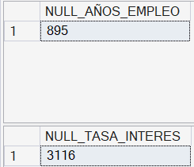

Se detectaron **895** registros nulos en la variable de Años de Empleo y **3,116** en la variable de Tasas de interés. Asimismo, se identificaron **7** registros atípicos (*outliers*), incluyendo edades irreales (mayores a 100 años) e inconsistencias lógicas entre edad y años de experiencia laboral. Estos datos deben ser filtrados antes de entrenar modelos de riesgo.

### 2. Volumetría y Ticket Promedio

**Situación del negocio:** Queremos calcular cual es el monto total de dinero colocado en préstamos históricamente y el monto del ticket promedio que se suele pedir.

```sql
SELECT 
    SUM(Monto) AS MONTO_DINERO_HISTORICO, 
    AVG(Monto) AS TICKET_PROMEDIO
FROM Prestamos;
```

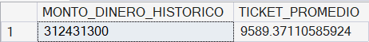

El banco tiene una colocación histórica total de **$312'431,300**, con un ticket promedio de crédito de **$9,589.37**. Este monto promedio confirma que la cartera analizada pertenece a banca *Retail* (consumo minorista) y no a banca corporativa.

### 3. Anomalías Demográficas (Outliers)

**Situación del negocio:** Queremos averiguar si existen registros ilógicos dentro de la base, como clientes con edades mayores a 100 años o cuyos años de empleo superan su propia edad.

```sql
SELECT 
    COUNT(*) AS OUTLIERS_DEMOGRAFICOS
FROM Clientes
WHERE 
    Edad > 100 
    OR 
    Años_Empleo > Edad;
```

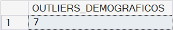

Se identificaron **7** registros atípicos que presentan inconsistencias lógicas (edades irreales o antigüedad laboral mayor a la edad biológica del cliente). Esto evidencia deficiencias en las reglas de validación durante la captura de datos en origen.

### 4. Distribución de Vivienda

**Situación del negocio:** Queremos saber cómo se distribuye la cartera de clientes según la situación de vivienda *(Rent, Mortage, Own)* y saber la cantidad de clientes por cada categoría.

```sql
SELECT 
    Tipo_Vivienda, 
    COUNT(*) AS CANTIDAD_TP_VIVIENDA
FROM Clientes
GROUP BY Tipo_Vivienda;
```

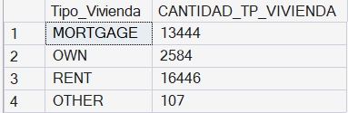

La distribución de la cartera por tipo de vivienda muestra que la mayoría de los clientes se concentran en el segmento de **Mortage *(Hipoteca)***, lo cual es un indicador crucial para la evaluación de garantías.

### 5. Concentración por motivos de préstamo

**Situación del negocio:** Queremos averiguar cuales son los diferentes motivos por los que las personas solicitan los préstamos y saber la cantidad de préstamos otorgados por motivo. *(Ordenados del más común al menos común)*


```sql
SELECT 
    Motivo_Prestamo, 
    COUNT(*) AS CANTIDAD_MOTIVO
FROM Prestamos
GROUP BY Motivo_Prestamo 
    ORDER BY CANTIDAD_MOTIVO DESC;
```

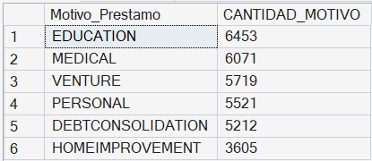

El principal motivo de endeudamiento de los clientes es **Educación**, lo que brinda una oportunidad clara para que el área comercial dirija campañas de retención o venta cruzada hacia ese producto específico.
 
## Cruces Relacionales y KPIs de Riesgo (Nivel Intermedio)
En esta fase, crucé las diferentes dimensiones del modelo relacional utilizando `JOINs` para calcular indicadores clave de rendimiento (KPIs) financieros y detectar perfiles de alto riesgo.

### 6. Morosidad vs. Tipo de Vivienda
**Situación de Negocio:** ¿El arraigo patrimonial influye en la cantidad de clientes que caen en morosidad?

```sql

SELECT 
	C.TIPO_VIVIENDA, 
	COUNT (*) AS CANT_PREST_DEFAULT
FROM Clientes AS C 
INNER JOIN PRESTAMOS AS P
	ON C.ID_Cliente = P.ID_Cliente
WHERE P.Estado_Prestamo = 1
GROUP BY C.Tipo_Vivienda 
ORDER BY CANT_PREST_DEFAULT DESC;
```

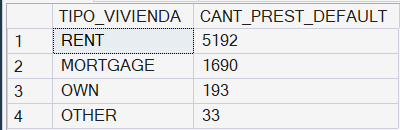

Los clientes que viven en condición de *Rent (Alquiler)* concentran la mayor cantidad de préstamos en morosidad con **5,192** operaciones.

### 7. El Peso del Historial Crediticio (Tasa de Morosidad)
**Situación de Negocio:** ¿Cuál es la tasa porcentual de morosidad actual de los clientes que ya traían un historial negativo previo frente a los que tenían un historial limpio?

``` sql

SELECT 
    -- Transformamos el 1 y 0 a Y y N solo para esta vista
    CASE 
        WHEN H.Historico_Morosidad = '1' THEN 'Y'
        WHEN H.Historico_Morosidad = '0' THEN 'N'
        ELSE H.Historico_Morosidad 
    END AS Historial_Morosidad_Previo,

    ROUND((SUM(CAST(P.Estado_Prestamo AS FLOAT)) / COUNT(*)) * 100, 2) AS TASA_MOROSIDAD_PORCENTAJE
FROM Historial_Crediticio AS H 
INNER JOIN Prestamos AS P
    ON H.ID_Cliente = P.ID_Cliente
GROUP BY 
    -- Agrupamos por la misma lógica del CASE
    CASE 
        WHEN H.Historico_Morosidad = '1' THEN 'Y'
        WHEN H.Historico_Morosidad = '0' THEN 'N'
        ELSE H.Historico_Morosidad 
    END
ORDER BY TASA_MOROSIDAD_PORCENTAJE DESC;

```

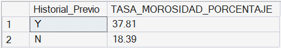

Encontré una correlación directa y crítica. Los clientes con historial negativo previo tienen una tasa de morosidad del **37.81%**, confirmando que el historial en otras entidades es un factor predictivo válido para nuestra cartera.

### 8. Puntos Ciegos Financieros (Filtros Agrupados de Alto Riesgo)
**Situación de Negocio:** Identificar los "agujeros negros" de la cartera: Motivos de préstamo que concentren alta frecuencia de default *(Morosidad)* con un número de operaciones mayor a 500 combinados con una alta exposición de capital *(ticket promedio > $10,000)*.

```sql

SELECT 
    Motivo_Prestamo, 
    COUNT(*) AS TOTAL
FROM Prestamos
GROUP BY Motivo_Prestamo
HAVING
    AVG(MONTO) > 10000
    AND
    SUM(ESTADO_PRESTAMO) > 500;

```

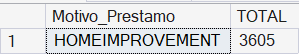

Encontré que los préstamos destinados a **HomeImprovement *(3,605)*** representan el mayor riesgo estructural para el banco, ya que combinan tickets altos con un volumen masivo de impagos.


### 9. Capacidad de Pago *REVISAR*
**Situación del Negocio:** ¿ Existe una relación directa entre el nivel de ingresos de un cliente, el monto del préstamo solicitado y su probabilidad de caer en morosidad *(sobreendeudamiento)*?

```sql

SELECT 
    CASE 
        WHEN P.Estado_Prestamo = '0' THEN 'PAGADO'
        WHEN P.Estado_Prestamo = '1' THEN 'MORA'
        ELSE CAST(P.Estado_Prestamo AS VARCHAR)
        END AS SITUACION_PRESTAMO, 

    ROUND(AVG(C.INGRESO_ANUAL),2) AS AVG_ING_ANNUAL, 
    ROUND(AVG(P.MONTO),2) AS AVG_MONTO_PRESTADO
FROM Clientes AS C
INNER JOIN Prestamos AS P
    ON C.ID_Cliente = P.ID_Cliente
GROUP BY 
    CASE 
        WHEN P.Estado_Prestamo = '0' THEN 'PAGADO'
        WHEN P.Estado_Prestamo = '1' THEN 'MORA'
        ELSE CAST(P.Estado_Prestamo AS VARCHAR)
        END;

```

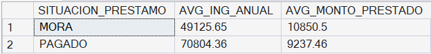


Los clientes en *Mora* representan un ingreso anual promedio de **$49,125.65**, un monto considerablemente menor a los **$70,804.36** de los clientes *Al día*. Sin embargo, de forma inversa, asumen un ticket promedio de deuda mayor promediando los **$10,850.50**. Confirmando matemáticamente que el detonante del impago es una alta carga financiera *(sobreendeudamiento)* otorgada a perfiles con menor capacidad de liquidez.

### 10. Riesgo Generacional
**Situación de Negocio:** ¿Qué segmento generacional representa el mayor volumen de operaciones en default *(Morosidad)* dentro de nuestra cartera?

```sql

SELECT 
    CASE 
        WHEN C.Edad < 25 THEN 'Jovenes'
        WHEN C.Edad BETWEEN 25 AND 40 THEN 'Adultos'
        WHEN C.Edad > 40 THEN 'Mayores'
        ELSE CAST(C.EDAD AS VARCHAR)
        END AS GRUPO_ETARIO,
    COUNT(*) AS TOTAL_G_ETARIO
FROM CLIENTES AS C
INNER JOIN Prestamos AS P
ON C.ID_Cliente = P.ID_Cliente
WHERE P.Estado_Prestamo = 1
GROUP BY 
    CASE 
        WHEN C.Edad < 25 THEN 'Jovenes'
        WHEN C.Edad BETWEEN 25 AND 40 THEN 'Adultos'
        WHEN C.Edad > 40 THEN 'Mayores'
        ELSE CAST(C.EDAD AS VARCHAR)
        END
ORDER BY TOTAL_G_ETARIO DESC;

```

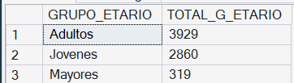

Al realizar la segmentación por grupos etarios descubrí que el grupo demográfico de **Adultos** concentra la mayor cantidad de préstamos en *morosidad* con **3,929** casos. Esto sugiere la necesidad de ajustar las politicas de originación para este segmento específico.

## Análisis Avanzado (Subconsultas, CTE's y Window Functions)
 En esta fase final, se utilizaron herramientas avanzadas de SQL para aislar poblaciones específicas, crear rankings dinámicos y segmentar la cartera de clientes para estrategias operativas.

 ### 11. Riesgo de Alta Exposición
 **Situación de Negocio:** ¿Cuántos de nuestros clientes morosos tienen deudas que superan el ticket promedio global del banco, representando un riesgo de pérdida de capital severo?

 ```sql

 SELECT COUNT(*) AS MOROSOS_SOBRE_PROMEDIO
FROM Prestamos
WHERE Estado_Prestamo = 1
AND
MONTO > (
SELECT AVG(MONTO)
FROM Prestamos
);

```

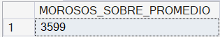

Identifiqué que existen **3,599** operaciones en *Morosidad* cuyo capital supera el promedio de la cartera. Esto representa *"focos rojos"* de mayor impacto financiero para el banco.

### 12. Aislamiento de Población Tóxica
**Situación de Negocio:** Buscamos aislar a los clientes con historial de morosidad en otras entidades para calcular su ticket promedio de deuda con nosotros.

```sql

WITH CLIENTES_RIESGOSOS AS (
-- Consulta para obtener los ID's de clientes con historial de morosidad en otros bancos 
-- los cuales se almacenarán en una tabla virtual para la futura consulta.
	SELECT ID_CLIENTE
	FROM Historial_Crediticio
	WHERE Historico_Morosidad = 1
)
-- Consulta principal, usando la tabla virtual anterior.
SELECT ROUND(AVG(MONTO),2) AS TICKET_PROMEDIO_RIESGOSO
FROM Prestamos AS P
INNER JOIN
CLIENTES_RIESGOSOS AS CR
	ON P.ID_Cliente = CR.ID_Cliente;

```

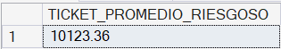

Encontré que la población con deuda previa en otros bancos tienen un ticket promedio con nuestro banco de **$ 10,123.36**. Otorgar líneas de crédito de esta magnitud a perfiles con *morosidad* comprobado evidencia una vulnerabilidad en las políticas de evaluación crediticia.

### 13. Top Riesgos por Producto
**Situación de Negocio:** Identificaremos los 3 préstamos de mayor cuantía (y mayor exposición) dentro de cada categoría o motivo de préstamo, sin perder el nivel de detalle del cliente.

```sql

WITH RANKING_PRESTAMOS AS 
(
SELECT 
	ID_Cliente,
	Motivo_Prestamo, 
	Monto,
	ROW_NUMBER() OVER( PARTITION BY MOTIVO_PRESTAMO ORDER BY MONTO DESC) AS RANKING
FROM Prestamos
)

SELECT *
FROM RANKING_PRESTAMOS
WHERE RANKING <= 3
ORDER BY ID_Cliente ASC;

```

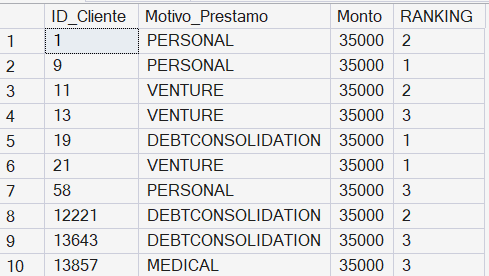

A través del uso de particiones de datos, logré aislar el "Top 3" de operaciones con mayor exposición de capital para cada categoría de préstamo. Esto es vital para el área de riesgos, ya que permite identificar y auditar expedientes de alta cuantía de forma individual (conservando el `ID_Cliente`) en lugar de depender de promedios abstractos, facilitando acciones directas de mitigación y cobranza sobre los deudores más pesados de cada producto.

### 14. Detección de Anomalías
**Situación de Negocio:** Detectar qué clientes tienen una deuda que supera significativamente el promedio de su propia categoría de préstamo, señalando posibles anomalías o sobre-aprobaciones.

```sql

WITH PROMEDIOS_POR_CATEGORIA AS
(
SELECT
	ID_Cliente, 
	Motivo_Prestamo, 
	Monto,
	ROUND(AVG(MONTO) OVER (PARTITION BY MOTIVO_PRESTAMO),2) AS PROMEDIO_CATEGORIA
FROM Prestamos
WHERE Estado_Prestamo = 1
)
SELECT *
FROM PROMEDIOS_POR_CATEGORIA
WHERE MONTO > PROMEDIO_CATEGORIA
ORDER BY ID_Cliente ASC;

```
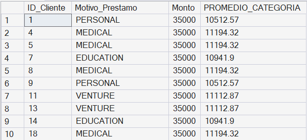

Logré aislar a los clientes cuyo default es asimétrico respecto a su grupo. Estos *"outliers"* representan los expedientes que deben ser auditados de manera prioritaria.

### 15. Estrategia de Cobranzas
**Situación de Negocio:** Optimizar los recursos del Call Center dividiendo la cartera de morosos en 4 grupos prioritarios *(cuartiles)* basados en la exposición de capital, para enfocar los esfuerzos de recuperación en los tickets más altos.

```sql

SELECT 
	ID_Cliente, 
	Monto,
	NTILE(4) OVER (ORDER BY MONTO DESC) AS CUARTIL_COBRANZA
FROM Prestamos
WHERE Estado_Prestamo = 1
ORDER BY 
	CUARTIL_COBRANZA ASC, 
	MONTO DESC, 
	ID_Cliente ASC;

```

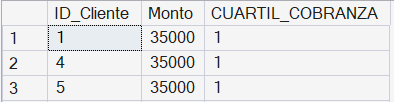
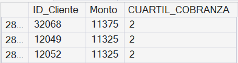
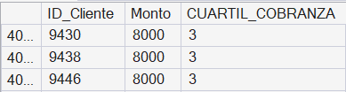
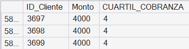

Segmenté la cartera de clientes en mora en 4 cuartiles. Siendo el Cuartil 1 el que contiene a los deudores con mayor impacto financiero, permitiendo al equipo de cobranzas priorizar sus acciones diarias y maximizar la recuperación del capital.

### Conclusiones:

1. Se detectaron datos ilógicos (ej. años de empleo > edad biológica). Es urgente implementar reglas de *Data Cleaning* automáticas en la originación antes de evaluar cualquier crédito.

2. Otorgar tickets altos (>$10,000) a clientes con morosidad en otras entidades es financieramente insostenible. Se debería considerar aplicar rechazos automáticos (*hard stops*) o exigir garantías reales a este segmento.

3. El principal detonante de impago no es un salario bajo, sino asumir una deuda desproporcionada. Se debe limitar estrictamente el ratio cuota/ingreso en las nuevas evaluaciones.

4. La morosidad se encuentra fuertemente concentrada en clientes que alquilan vivienda y en grupos etarios específicos. Estos segmentos requieren productos con límites de crédito más conservadores.

5. Dividir a los morosos en 4 cuartiles según su exposición de capital permite al Call Center atacar primero el "Cuartil 1" (las deudas más grandes), maximizando la recuperación de liquidez con el mismo esfuerzo operativo.
